# Health Assessment Program

# Overview

This system will assess the health aspect of the user including mental health, physical health, and their nutrition.
# Sustainable Development Goals or SDGs

This program is connected to SDG no.3 Goodhealth and Well-being because it assess the health aspects of the user. We've chosen this topic because we believe that health is needed to be first more than anything.

# Screenshots of the Program
The first part of the program which is the main menu

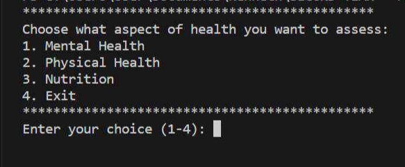

After choosing what aspect of health the system will give a 10 question that the user will
answer.

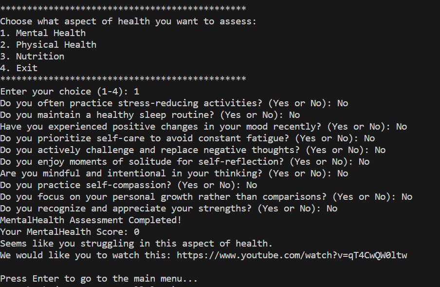

The program will also suggest an accessible video based on their score.

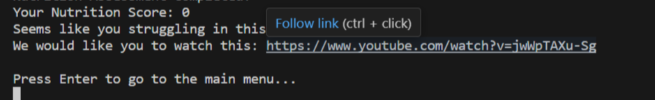

If you’re struggling in Mental Health, this is the recommended video

A fine Mental Health will also recommend a video on how to maintain it.

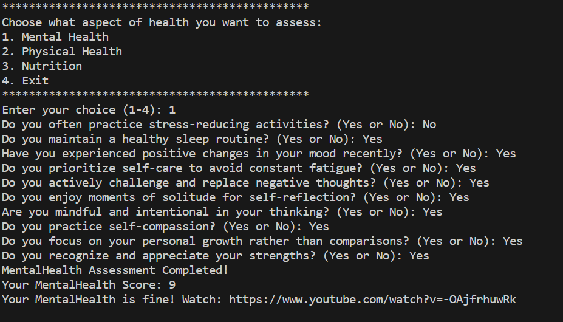

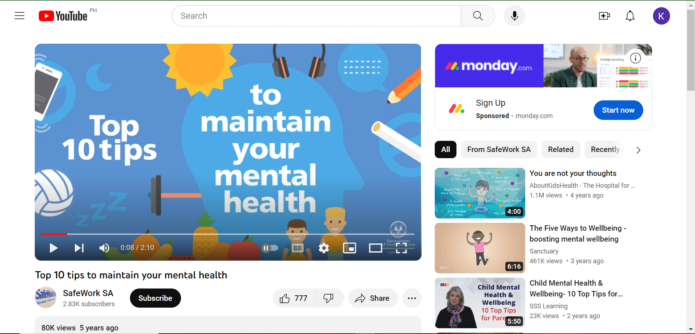

After assesing a health aspect the program will ask to user to enter to go to the main
menu and the program will ask the user again if he wants to assess another aspect of
health.

A fine Physical Health and the recommended video.

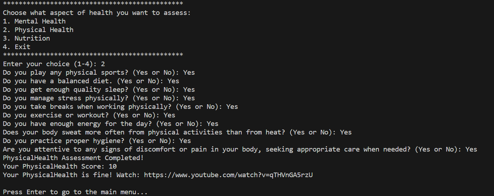

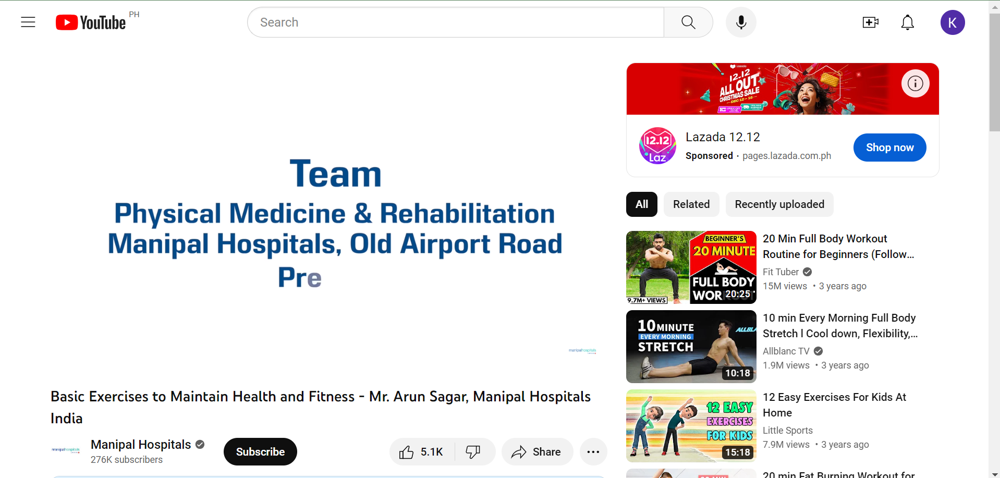

A struggling Physical Health and the recommended video.

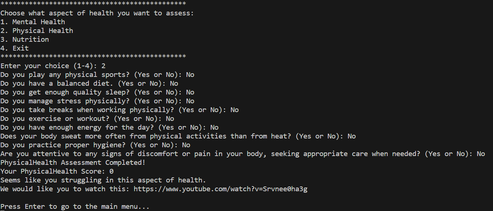

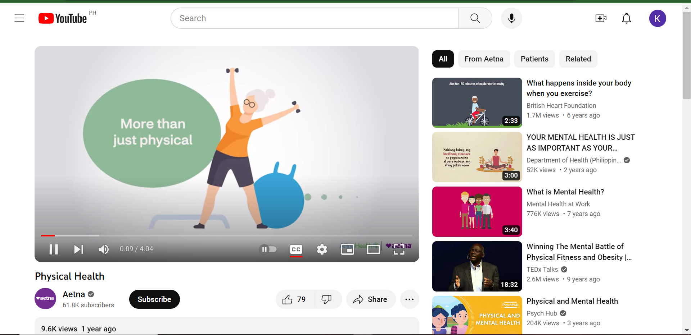

A fine Nutrition and the recommended video.

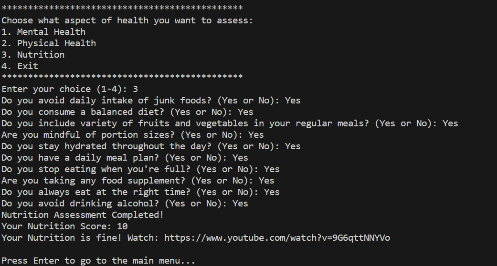

A struggling Nutrition and the recommended video.

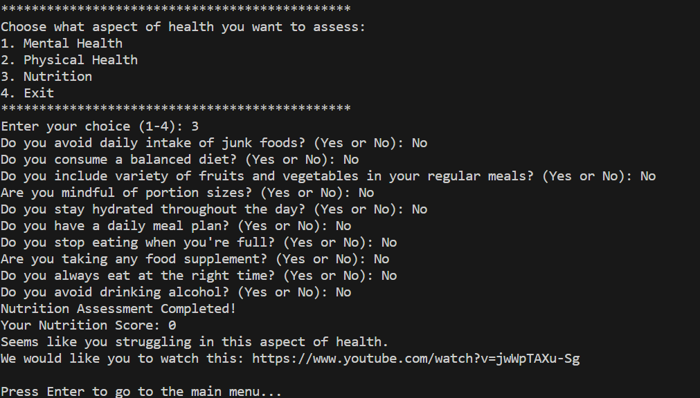

And if the user wants to end the program he can input 4 on the choice to end or exit the
program.

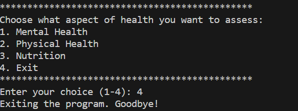

# Overall Function of This Program

It will help you assess you Mental Health, Physical Health, and Nutrition. This program will give you list of 10 questions that is answerable by yes or no. If the system finds out that you’re struggling in the specific health aspect it will suggest a accessible video link that helps you to improve that health aspects and if it finds out that you are doing fine in that specific health aspect, up it will suggest a video that helps you to maintain it.

# Self Assessment of the Program
Based on the given rubric for grading, the group assesed the system and it resulted to this:
| Metric  |  4 | 3  | 2  |  1 |
|---|---|---|---|---|
| Code Reusability  |   | ✔  |   |   |
| Maintainability  |   | ✔  |   |   |
| Scalability  |   | ✔  |   |   |
| Execution  | ✔  |   |   |   |
| Originality  |  | ✔ |   |   |
| Overall Impression    |  | ✔  |   |

# Members and their Contribution

  Lincallo, Eduardo Gabriel S.  –  25%
  
Rante, Harold M.                   –  25%

Alog, Zyrus James                -   25%

Garcia, Preben                       -  25%

Lincallo, Eduardo Gabriel S. - 
Responsible for the idea of this system. Contributed to the code.Also contributed on the assessment questions on different fields of health.

Rante, Harold M. - 
Responsible for code polishing, the structure of the system may be not like this if it is not because of him.

Alog, Zyrus James - 
Responsible for editing video presentation as well as incorporating the oop principles in the code.

Garcia, Preben - 
Responsible for researching for the video through youtube that been used in the program. Also contributed on the assessment questions on different fields of health.
